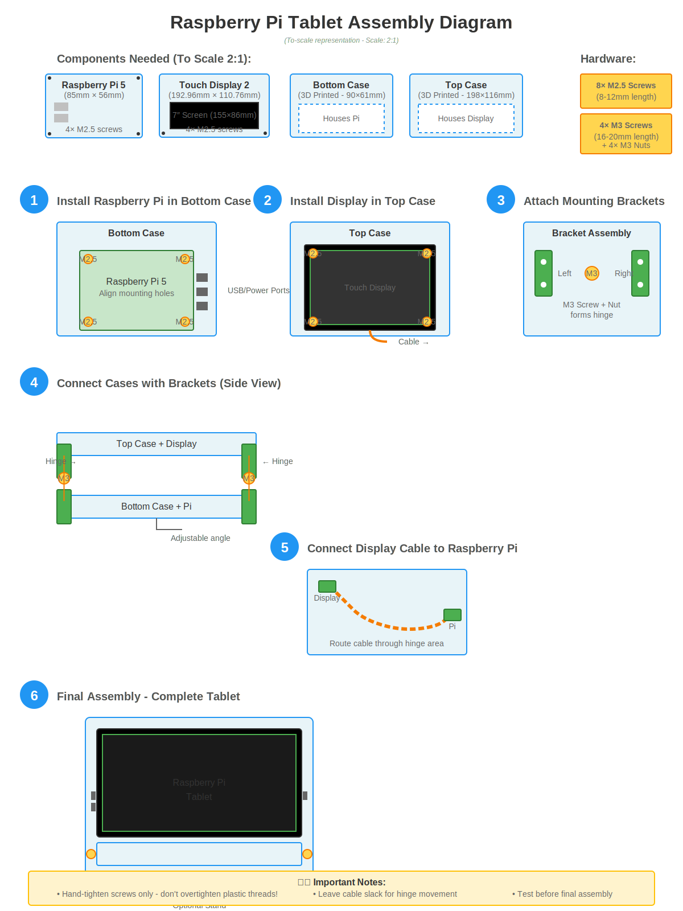

# Assembly Guide

Step-by-step instructions for assembling your Raspberry Pi Tablet.

## Assembly Diagram



The diagram above shows the complete assembly process from components to finished tablet. Follow the numbered steps below for detailed instructions.

## Before You Begin

### Checklist
- [ ] All 3D printed parts are ready
- [ ] All electronic components are on hand
- [ ] All screws and hardware are ready
- [ ] Small Phillips screwdriver available
- [ ] microSD card is flashed with Raspberry Pi OS

### Recommended Setup Order
1. Prepare the Raspberry Pi
2. Test components before assembly
3. Assemble bottom case
4. Assemble top case
5. Connect cases with brackets
6. Final testing

## Step 1: Prepare the Raspberry Pi 5

### 1.1 Flash the Operating System
1. Download [Raspberry Pi Imager](https://www.raspberrypi.com/software/)
2. Insert microSD card into your computer
3. Open Raspberry Pi Imager
4. Choose OS: Raspberry Pi OS (64-bit recommended)
5. Choose Storage: Your microSD card
6. Click "Write" and wait for completion

### 1.2 Initial Setup (Optional but Recommended)
1. Insert microSD into Raspberry Pi
2. Connect HDMI to monitor
3. Connect keyboard and mouse
4. Connect power
5. Complete initial setup wizard
6. Update system: `sudo apt update && sudo apt upgrade`
7. Test that everything works
8. Shut down: `sudo shutdown now`

## Step 2: Install Raspberry Pi in Bottom Case

### 2.1 Check Fit
1. Place Raspberry Pi 5 into bottom case (without screws first)
2. Verify all ports align with cutouts:
   - USB ports on one side
   - HDMI and power on opposite side
   - SD card slot on end
3. If alignment is off, check:
   - Case is printed to correct scale
   - Mounting posts are not damaged

### 2.2 Secure the Board
1. Align Raspberry Pi mounting holes with case posts
2. Insert M2.5 screws through board holes
3. Thread screws into mounting posts
4. Tighten screws gently (don't overtighten!)
5. Verify board is secure but not stressed

**Torque Note**: Hand-tight with small screwdriver. If plastic posts crack, you're too tight!

## Step 3: Install Display in Top Case

### 3.1 Position the Display
1. Orient the display with touchscreen facing down
2. Lower display PCB into the recessed pocket
3. Screen should align with front cutout
4. Cable connector should be near cable access hole

### 3.2 Secure the Display
1. Align display mounting holes with posts
2. Insert M2.5 screws (4 total)
3. Tighten gently and evenly
4. Verify display is flat and secure

### 3.3 Connect Display Cable
1. Locate the display cable (flat ribbon cable)
2. Thread cable through the cable access hole
3. Don't connect to Raspberry Pi yet
4. Leave some slack for hinge movement

## Step 4: Attach Mounting Brackets

### 4.1 Identify Bracket Positions
- Left side: 2 brackets (L1, L2)
- Right side: 2 brackets (R1, R2)
- Each side forms a hinge

### 4.2 Bottom Case Brackets
1. Position L1 and R1 on respective sides of bottom case
2. Align mounting holes with case attachment points
3. Use M2.5 screws to secure (if using case attachment holes)
4. Brackets should be flush with case edge

### 4.3 Top Case Brackets  
1. Position L2 and R2 on respective sides of top case
2. Ensure proper orientation (hinges should align)
3. Secure with M2.5 screws

### 4.4 Create Hinges
1. Align L1 and L2 hinge holes
2. Insert M3 screw through both brackets
3. Add M3 nut on opposite side
4. Tighten until snug but allows rotation
5. Repeat for R1 and R2 on right side

**Hinge Adjustment**: Screws should be tight enough to hold position but loose enough to adjust angle smoothly.

## Step 5: Connect Display to Raspberry Pi

### 5.1 Locate Connectors
- Display cable: Short ribbon cable with small connectors
- Raspberry Pi connector: Usually near HDMI ports (check Pi 5 documentation)

### 5.2 Make Connection
1. Open angle between top and bottom cases
2. Locate display connector on Raspberry Pi 5
3. Gently insert display cable
   - Cable has a specific orientation (check keying)
   - Should slide in smoothly - don't force!
4. Secure connector latch if present

### 5.3 Route Cable
1. Ensure cable has gentle curves (no sharp bends)
2. Cable should have slack for angle adjustment
3. Cable should not pinch when cases are at any angle

## Step 6: First Power-On Test

### 6.1 Pre-Power Checks
- [ ] All screws are secured
- [ ] Display cable is connected
- [ ] No loose parts inside cases
- [ ] Port cutouts are clear

### 6.2 Power On
1. Connect USB-C power supply to Raspberry Pi
2. Power LED should illuminate
3. Display should show boot sequence (10-30 seconds)
4. Touchscreen should be responsive

### 6.3 Troubleshooting First Boot
| Problem | Solution |
|---------|----------|
| No power LED | Check power supply, verify proper connection |
| Power LED but no display | Check display cable connection, reseat cable |
| Display shows rainbow screen only | Check microSD card is properly inserted and flashed |
| Touch not working | May need to enable in Raspberry Pi config |
| Overheating warning | Ensure ventilation holes are clear, consider heatsink |

## Step 7: Final Assembly and Calibration

### 7.1 Adjust Viewing Angle
1. Loosen hinge screws slightly if needed
2. Adjust to desired angle (typically 100-120 degrees)
3. Tighten hinge screws to hold position

### 7.2 Optional: Attach Stand
1. Position tablet in stand's lip
2. Verify stable positioning
3. Adjust stand angle if needed

### 7.3 Cable Management
1. Ensure power cable exits cleanly
2. Use cable clips if needed
3. Keep cables organized

## Step 8: Software Configuration

### 8.1 Display Settings
1. Open Raspberry Pi Configuration
2. Go to Display settings
3. Set orientation if needed
4. Adjust resolution (720×1280 native)

### 8.2 Touch Calibration (if needed)
```bash
sudo apt-get install xinput-calibrator
xinput_calibrator
```
Follow on-screen instructions.

### 8.3 Recommended Setup
- Enable screen saver timeout
- Adjust brightness settings
- Configure auto-login if desired
- Install preferred applications

## Maintenance

### Regular Checks
- **Weekly**: Check screw tightness
- **Monthly**: Clean screen with microfiber cloth
- **Quarterly**: Check ventilation holes for dust

### Cleaning
- **Screen**: Microfiber cloth, slightly damp if needed
- **Case**: Dry cloth or slightly damp for stubborn marks
- **Ventilation**: Compressed air or soft brush

### Storage
- Power off before long-term storage
- Store in cool, dry place
- Avoid direct sunlight (can warp plastic)

## Troubleshooting Common Issues

### Display Issues
- **Flickering**: Check cable connection, check power supply current
- **No backlight**: Display cable may be reversed
- **Touch offset**: Run touch calibration

### Physical Issues
- **Loose hinges**: Tighten M3 screws
- **Creaking sounds**: Check for over-tightened screws, add tiny bit of lubricant to hinges
- **Case doesn't close**: Check for cable pinching, verify components are seated properly

### Performance Issues
- **Overheating**: Ensure ventilation is clear, reduce CPU load, add heatsink
- **Slow performance**: Close unused apps, check for background processes
- **Wi-Fi problems**: Check antenna is not blocked by case

## Safety Notes

⚠️ **Important Safety Information**:
- Never force screws - plastic threads can strip
- Don't drop the assembled tablet - screen is fragile
- Keep away from water and liquids
- Allow adequate ventilation during use
- Use only proper power supply (27W USB-C for Pi 5)
- Supervise children during use

## Getting Help

If you encounter issues:
1. Check this guide's troubleshooting section
2. Review the [3D models README](3d-models/README.md)
3. Search Raspberry Pi forums
4. Open an issue on GitHub
5. Ask in Raspberry Pi communities

## Enjoy Your Tablet!

Congratulations on building your Raspberry Pi Tablet! Here are some project ideas:
- Portable retro gaming device
- Smart home control panel
- Digital photo frame
- Learning and education tool
- Portable coding workstation
- IoT dashboard

Happy making! 🎉
